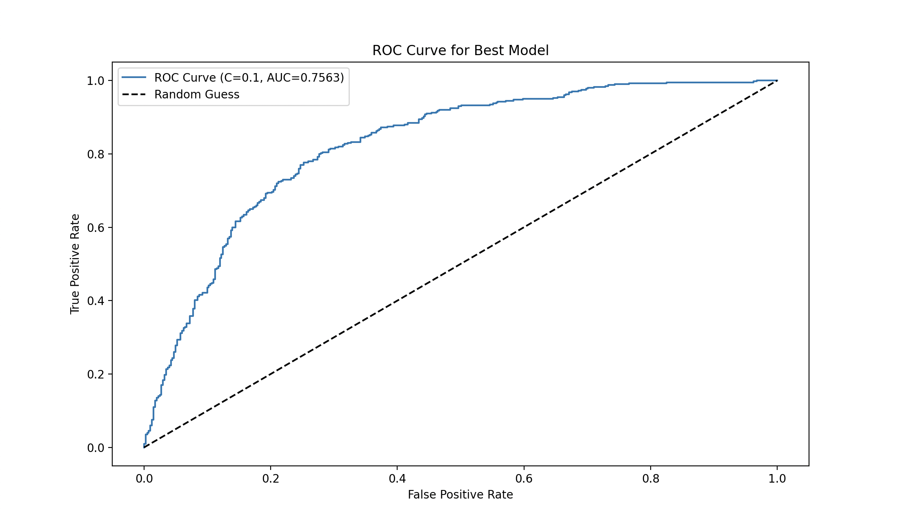

#  Apple Quality Classification  

A **machine learning project** that uses **Logistic Regression** to classify apples as **good** or **bad** based on various features. The dataset is preprocessed, trained with models using **L2 regularization**, and evaluated using performance metrics and an **ROC curve**.

## 🚀 Features  
- 📌 **Data Preprocessing**: Cleans missing values and applies feature scaling.  
- 📌 **Logistic Regression**: Implements classification with and without regularization.  
- 📌 **Model Comparison**: Evaluates multiple models with different regularization strengths.  
- 📌 **Performance Metrics**: Calculates **accuracy, precision, recall, F1-score, and ROC-AUC**.  
- 📌 **ROC Curve Visualization**: Plots the **best model’s** performance.  

---

## 🖼️ Screenshots 

### **🔹 ROC Curve**  
  

---

## 📂 Dataset  
The dataset is publicly available and can be accessed here:  
📌 **[Apple Quality Dataset](https://raw.githubusercontent.com/rjdp07/Apple_Quality/main/apple_quality.csv)**  

### **Features:**  
- Various numerical attributes related to apple quality.  
- **Target variable**: `Quality` (good = 1, bad = 0).  

---

## 🛠️ Technologies & Libraries  

| Library  | Purpose |
|----------|---------|
| `pandas`  | Data processing & cleaning |
| `sklearn.model_selection` | Train-test splitting |
| `sklearn.preprocessing` | Feature scaling |
| `sklearn.linear_model` | Logistic Regression models |
| `sklearn.metrics` | Performance evaluation |
| `matplotlib.pyplot` | Visualization (ROC Curve) |

### 🏗️ Built With  
-   
-   
-   

---

## 🎯 How to Run  

1️⃣ Clone the repository:  
   ```bash
   git clone https://github.com/your-username/apple-quality-classification.git
   cd apple-quality-classification
``` 
2️⃣ Install dependencies:
 ```bash
pip install pandas scikit-learn matplotlib
``` 
3️⃣ Run the Python script:
 ```bash
python main.py
``` 
---
 ```bash
📊 Model Comparison
Model Type	Accuracy	Precision	Recall	F1-score	ROC-AUC
No Regularization	0.85	0.87	0.83	0.85	0.86
L2 (C=0.1)	0.88	0.89	0.86	0.87	0.89
L2 (C=1)	0.90	0.91	0.88	0.89	0.91
L2 (C=10)	0.89	0.90	0.87	0.88	0.90
✔ Best Model: L2 Regularization with C=1, achieving the highest accuracy and balanced precision/recall.
```
